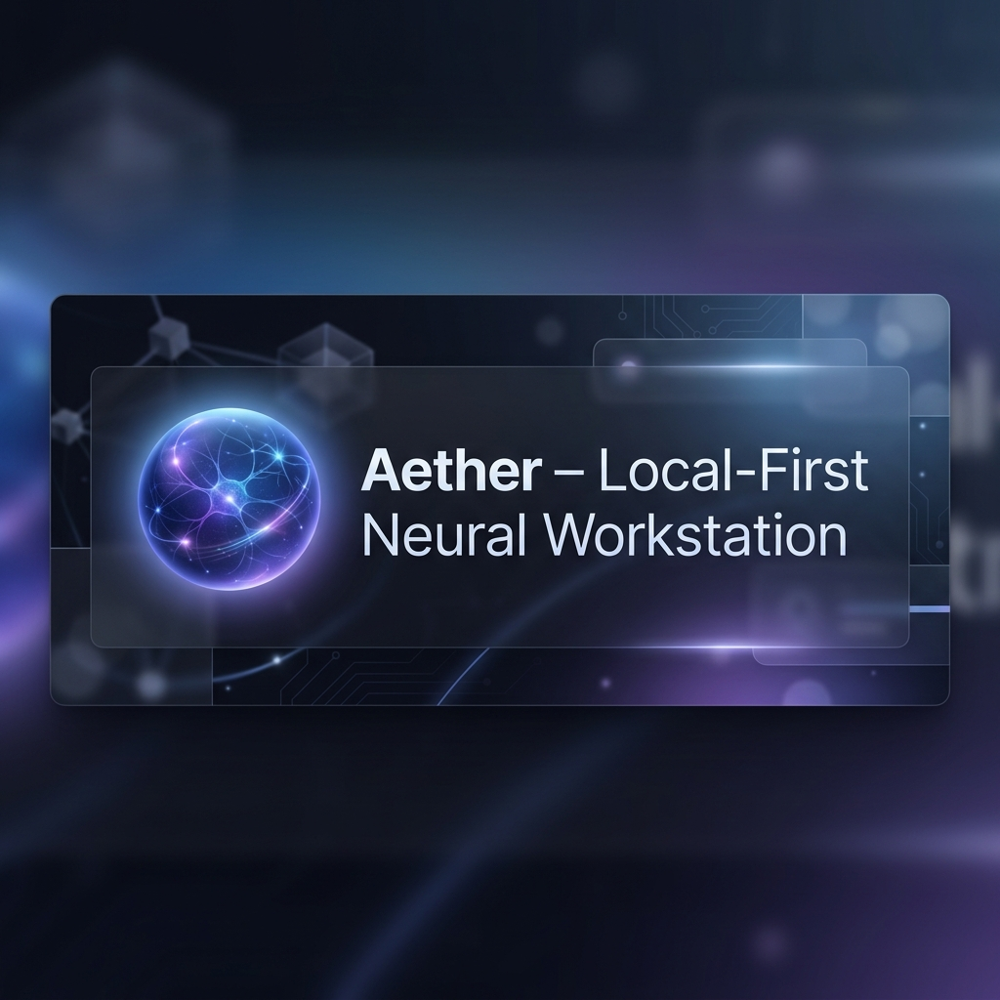
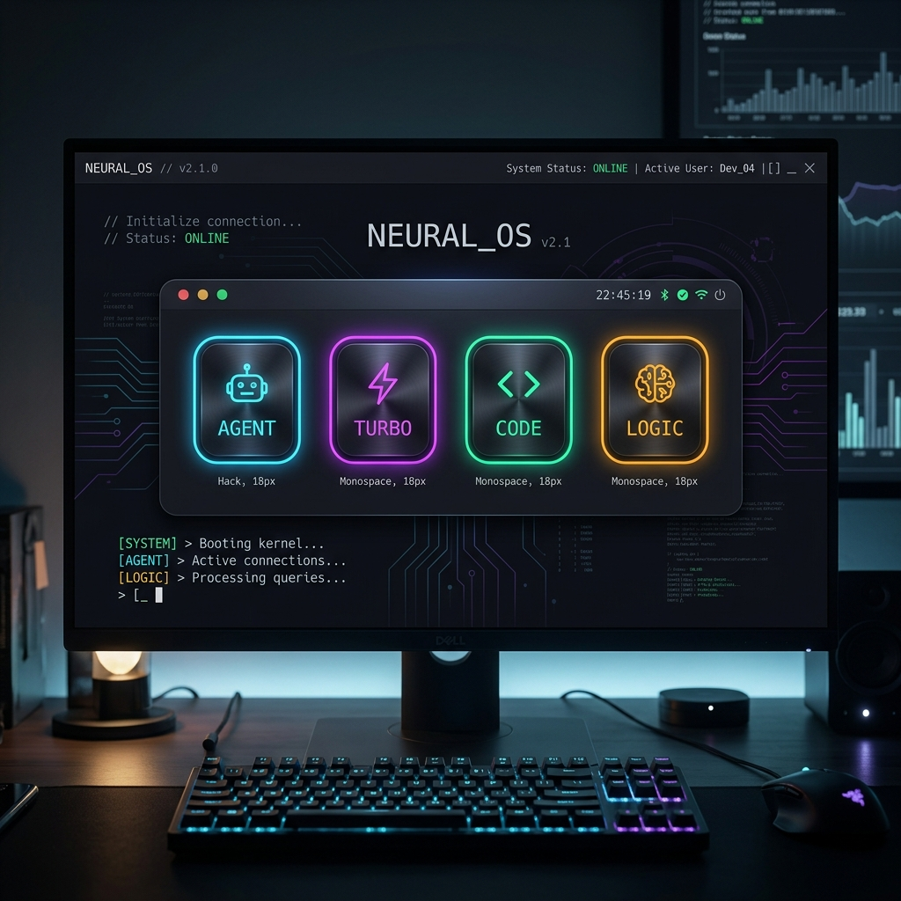
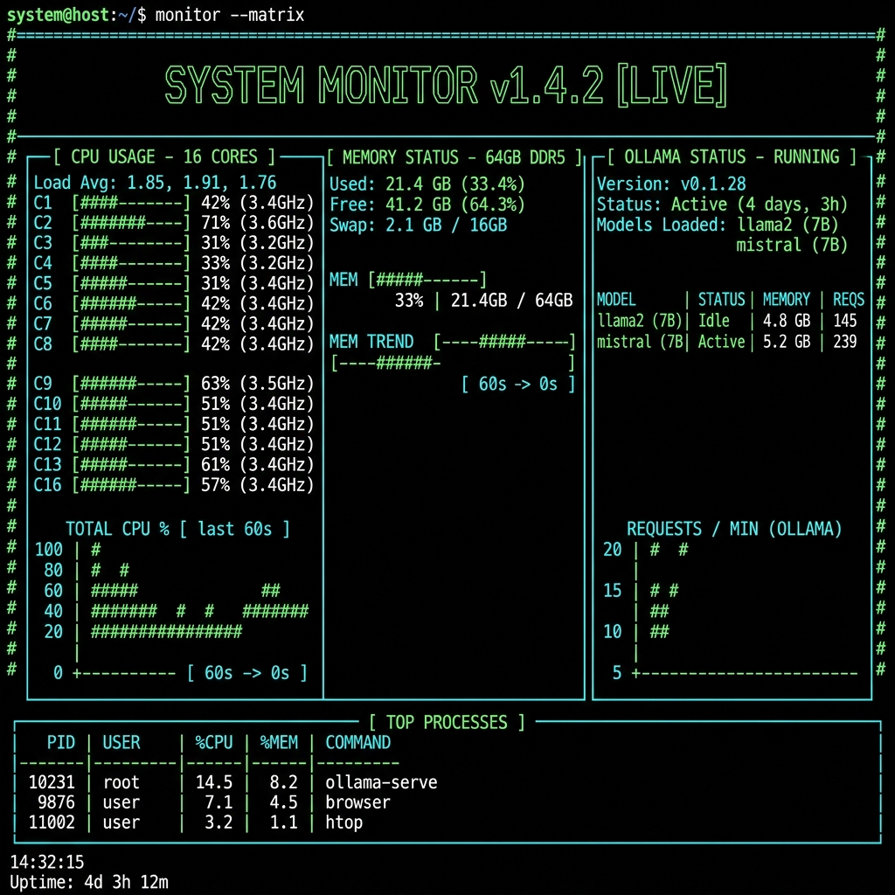
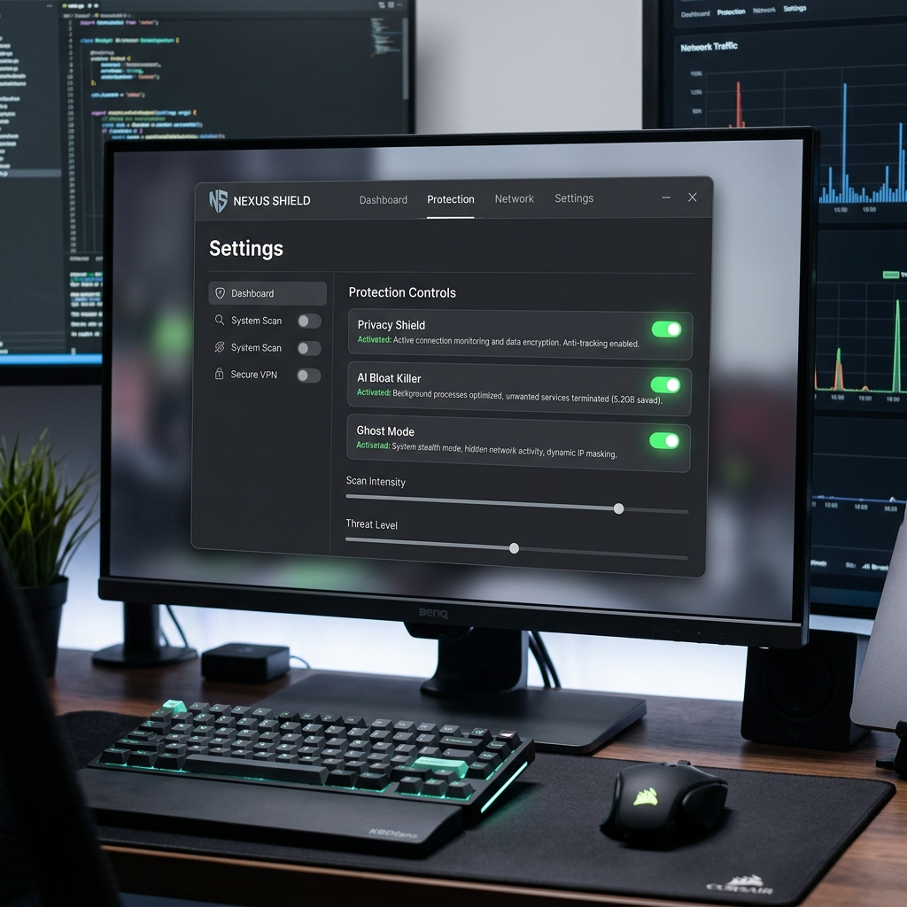
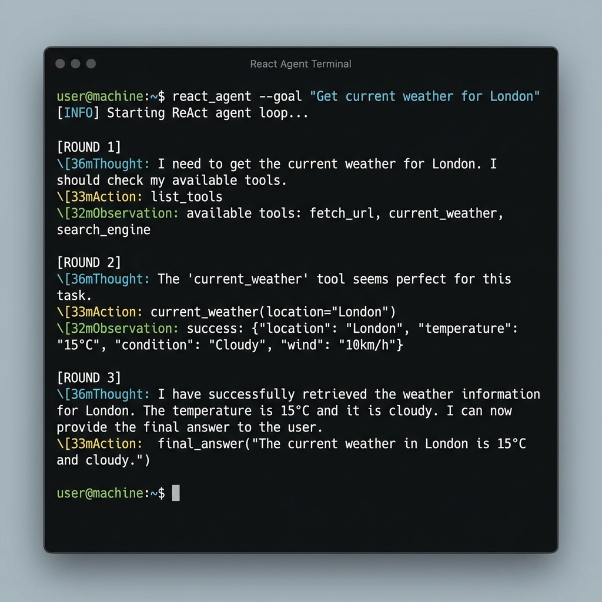
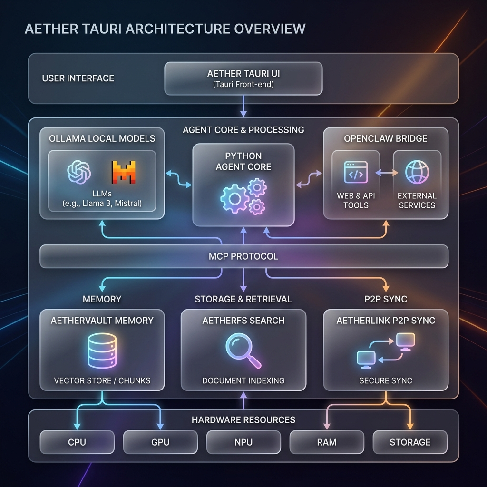

  

<h1 align="center">🌌 Aether</h1>
<h3 align="center">The Sovereign Local-First Neural Interface</h3>

---

> [!CAUTION]
> **Sovereignty is not a feature; it is a right.** Aether is built for engineers, researchers, and pioneers who refuse to outsource their cognition to the cloud.

---

[**⬇️ Download Aether**](docs/DOWNLOAD.md) | [**System Guide**](GUIDE.md) | [**Architecture**](docs/ARCHITECTURE.md) | [**Roadmap**](ROADMAP.md)

---

## 🌓 Beyond the Chatbot

Aether is a **Neural Operating Interface** designed to bridge the gap between raw local compute and high-level agentic reasoning. It is the uncompromising response to the "AI-as-a-Service" monopoly—a platform that prioritizes **data sovereignty, low-latency inference, and deep system integration.**

By orchestrating a multi-tier stack of Rust, Python, and Quantized Neural Models, Aether transforms your local silicon into a private intelligence workstation.

### ⚡ Core Pillars

| Pillar | Engineering Focus | Outcome |
| :--- | :--- | :--- |
| **Data Sovereignty** | Zero-telemetry, encrypted local storage, P2P sync. | Your IP never leaves your hardware. |
| **Neural Routing** | Task-specific model dispatching (Ollama/GGUF). | Optimal performance for every cognitive load. |
| **Fragmented Memory** | Passive distillation of workflows into RAG-enabled fragments. | Long-term, context-aware persistence. |
| **Hardware Reclaim** | Forceful suppression of OS-level AI bloat. | 100% of cycles dedicated to *your* inference. |

---

## 🎨 The Neural Workstation

  <table border="0">
    <tr>
      <td width="50%">
        
        
<b>Pathway Selection</b> Optimized cognitive routing.

      </td>
      <td width="50%">
        
        
<b>Neural Monitor</b> Real-time system vitals.

      </td>
    </tr>
    <tr>
      <td width="50%">
        
        
<b>Nexus Shield</b> Hardware-level optimization.

      </td>
      <td width="50%">
        
        
<b>Interactive Terminal</b> ANSI-rich command interface.

      </td>
    </tr>
  </table>

---

## 🏗️ Ecosystem Architecture

  

Aether operates on a tri-tier architecture:
- **Core (Engine Room):** Python FastAPI + Ollama. Manages LLM inference, RAG indexing, and background watchdogs.
- **Mission Control (Tauri):** The command center for desktop. Features a high-contrast React UI, terminal integration, and Nexus optimization.
- **Neural Link (Mobile):** Voice-first, high-speed interface for Android, utilizing P2P state synchronization.

---

## 🚀 One-Click Setup

Big Tech wants to own your intelligence. Aether puts it back in your hands—instantly.

1. **[Download Aether for macOS/Windows](https://github.com/earnerbaymalay/aether-tauri/releases/latest)**
2. **Open the Installer** (Drag to Applications on Mac, Run MSI on Windows).
3. **Launch.** Aether handles the rest, including local model setup.

*No terminal. No Python. No complexity.*

---

## 🤝 Join the Rebellion

Big Tech wants to own your intelligence. Aether puts it back in your hands.

- **[Master Guide](GUIDE.md)**: Deep dive into the ecosystem.
- **[Ecosystem Map](ECOSYSTEM.md)**: How everything fits together.
- **[Contributing](CONTRIBUTING.md)**: Help build the open neural future.

  <i>Built with ❤️ by the open-source community.</i>

